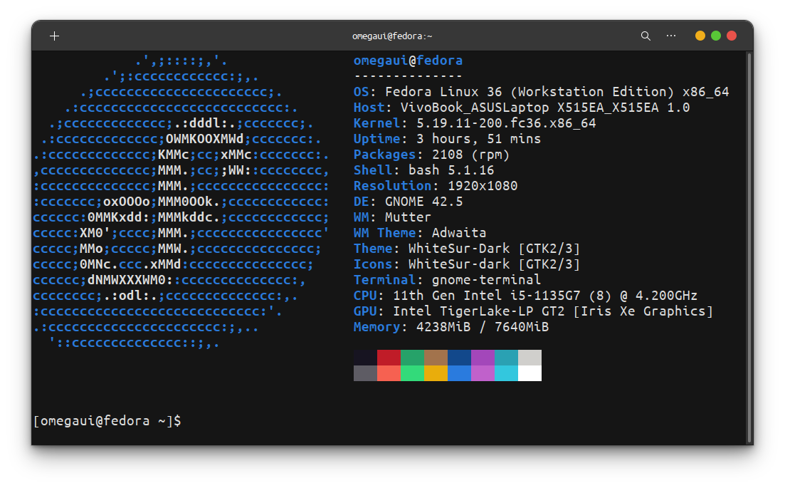

<div align="center">
    
    <h2>Linux Voice Control</h2>
</div>


<div align="center"><h3><strong>See it in action</strong></h3></div>


<div align="center">
    
    
    

</div>


#  Usage / Install

Well, this voice control system is currently in the basic mode ...

Lets quick finish the setup and tell you how
```shell
git clone https://github.com/omegaui/linux-voice-control
cd linux-voice-control
./install.sh
```

The `install.sh` script will set up your installation of linux-voice-control by installing some dependencies with pip.

The above process will finish off writing `lvc-config.json` and `lvc-commands.json` file to your root (~) and also the sources to `~/lvc-bin`.
That's how the first two lines of `lvc-config.json` look initially ...
```
{
  "name": "alex", # name of your control system
  "record-duration": 3, # duration in which you will speak your command ... simultaneously keeps on listening for every 3s
...
```
<div align="center"><strong>lvc-config.json</strong></div>

Let's take a look at the game controller ... `lvc-commands.json`
```json
{
  "open firefox": "firefox",
  "open editor": "gedit",
  "lock the screen": "xdg-screensaver lock",
  "open whatsapp": "firefox https://web.whatsapp.com",
  "open instagram": "firefox https://instagram.com",
  "write an email": "firefox https://mail.google.com/mail/u/0/#inbox"
}
```
<div align="center"><strong>lvc-commands.json</strong></div> 

You must be able to infer from above by now, that the keys are your speeches actually and their values are the corresponding commands that are to be executed each time you name those keys.

But wait ... understand how it's actually working in the background.

Let's take an example how it accurately recognizes your commands and your actual speeches.

First if you're really feeling happy to know about this project, then, you must thank [openai's whisper](https://github.com/openai/whisper)
it's actually the root and the stem of this project being a reality.
Want to know why? Just click on the link above.

After getting the audio transcription, a fuzzy match is applied against the keys in the `lvc-commands.json`.

Just like you search something on Google and getting the correct results even after typing the wrong spelling.

Your installation is all set for usage (for forking too 😉).
Just hit `linux-voice-control` in the terminal.

**Life Saver Tip: Add `linux-voice-control` to your startup scripts**

**Future Ideas**: Adding Dynamic Voice Control like _hey alex ... call spiderman_ (you already know things like that) and most important things [discussions](https://github.com/omegaui/linux-voice-control/discussions)

#  Build from source

Super simple things you know ...
```shell
git clone https://github.com/omegaui/linux-voice-control
cd linux-voice-control
pip install -r requirements.txt
python3 main.py
```

#  Ok Tested!

<div align="center">
    <em>
        The project is finely tested on <strong>fedora 36 Workstation</strong>
    </em>
</div>

#  Extending Usage

```json
{
  "open firefox": "firefox",
  "open editor": "gedit",
  "lock the screen": "xdg-screensaver lock",
  "open whatsapp": "firefox https://web.whatsapp.com",
  "open instagram": "firefox https://instagram.com",
  "write an email": "firefox https://mail.google.com/mail/u/0/#inbox"
}
```
<div align="center"><strong>lvc-commands.json</strong></div> 

The values here seem just like single commands running when matching key is triggered.

But wait ... it doesn't ends here.

You can even do more with this, i.e. you can write a shell script or any other program, that can be used to
perform some other complex task.

### Example
```json
...
"its time to rock": "/usr/bin/setup-spotify-chill-mode"
...
```
<div align="center">A new entry in <strong>lvc-commands.json</strong></div> 


```bash
#!/bin/bash
echo "Listen I don't know actually how to do this ... but I think you got what I mean ..."
# some code here that launches spotify and starts playing that playlist
```
<div align="center"><strong>setup-spotify-chill-mode.sh</strong></div> 


